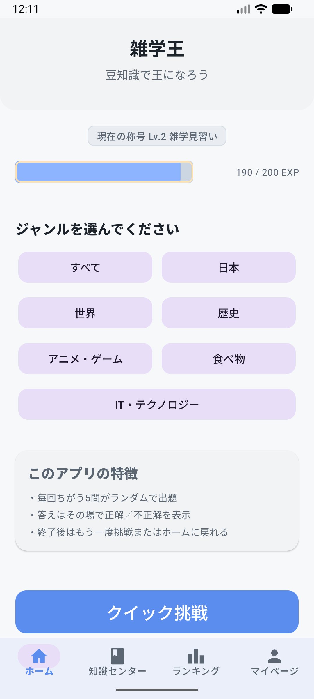
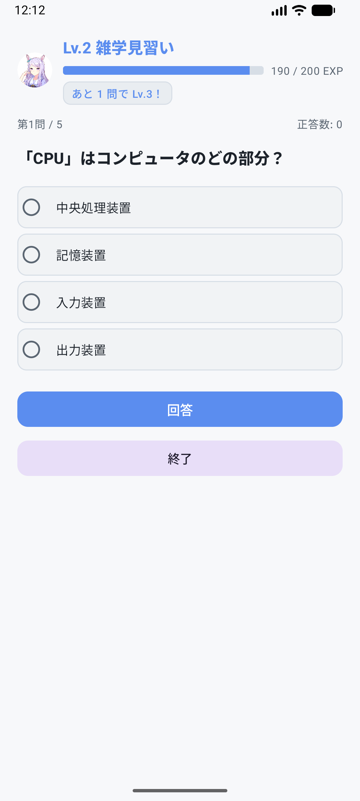
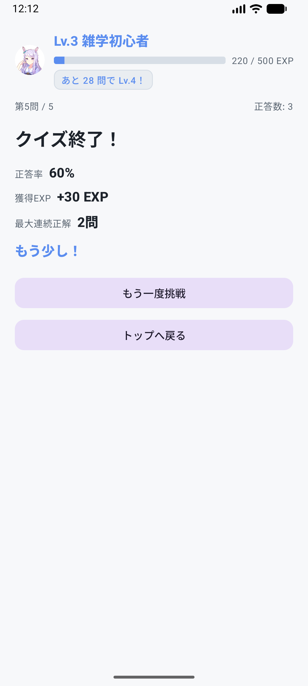
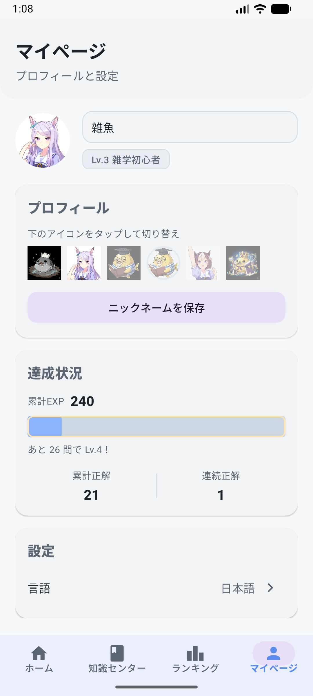

# 雑学王 (Zatsugaku King)

> 雑学クイズで楽しく学べる Android アプリです。

---

## デモ

  
  
  
  

  <strong>ホーム</strong> &nbsp; <strong>クイズ</strong> &nbsp; <strong>リザルト</strong> &nbsp; <strong>マイページ</strong>

---

## 主な機能

| 機能 | 説明 |
|------|------|
| **ホーム** | クイック挑戦でランダム5問のクイズを開始 |
| **クイズ** | ランダム出題・即時正誤表示。正解でEXP、連続・全問正解でボーナス |
| **知識センター** | ジャンル別に学べる（すべて・日本・世界・IT・アニメ・食べ物・歴史など） |
| **ランキング** | 累計正答数で順位表示 |
| **マイページ** | ニックネーム・アイコン、言語切替（日・英・中）、累計EXP・称号（Lv.1〜10）・アバター解放 |

---

## 技術

- **言語** Kotlin
- **UI** ViewBinding / ViewModel + Fragment
- **多言語** 日本語・英語・中国語

---

## 実行方法

1. リポジトリをクローンする
2. Android Studio でプロジェクトを開く
3. 端末またはエミュレータを接続し、**Run** で起動する

---

## 免責事項

本アプリは**テスト・検証用**です。クイズの内容の正確性・完全性・有用性について一切保証しません。利用は自己責任でお願いします。
